<<<<<<< HEAD
Вот версия в совершенно другом стиле оформления — более современном, лаконичном и «продуктовом» (как в хороших репозиториях на GitHub):

```markdown
# TaskFlow Backend

Современный API для управления задачами на FastAPI.

### Возможности

-  Регистрация и авторизация через JWT  
-  Полный CRUD задач  
-  Роли пользователей: **user** и **admin**  
-  Кэширование задач с помощью Redis  

---

### Архитектура

Проект построен по принципам **Clean Architecture** и разделён на чёткие слои:

- **core** — конфигурация, БД, безопасность  
- **models** — SQLAlchemy модели  
- **schemas** — Pydantic схемы валидации  
- **repositories** — работа с данными  
- **services** — бизнес-логика  
- **api** — маршруты и эндпоинты  


---

### Запуск

```bash
docker-compose up --build
```

Приложение будет доступно по адресу:  
**http://localhost:8000/docs**

---

### API Эндпоинты

**Авторизация**
- `POST /auth/register`
- `POST /auth/login`
- `GET /auth/me`

**Задачи**
- `POST /tasks/` — создать
- `GET /tasks/` — список
- `GET /tasks/{task_id}` — получить
- `PATCH /tasks/{task_id}` — обновить
- `DELETE /tasks/{task_id}` — удалить

**Админ**
- `GET /admin/users` — список пользователей

---

### Скриншоты

**Управление задачами**  
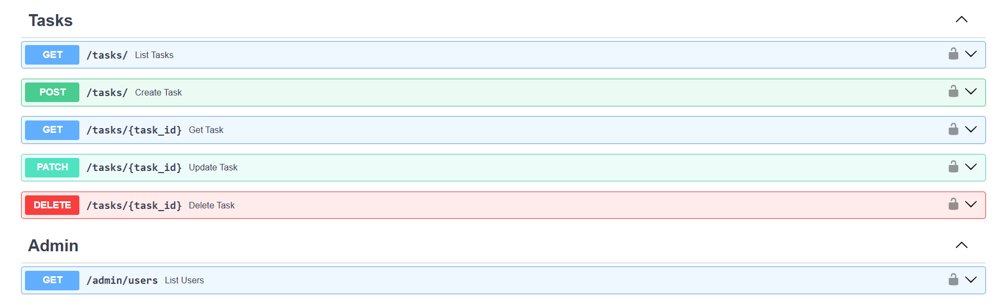

**Админ-панель**  


**Документация и интерфейс**  
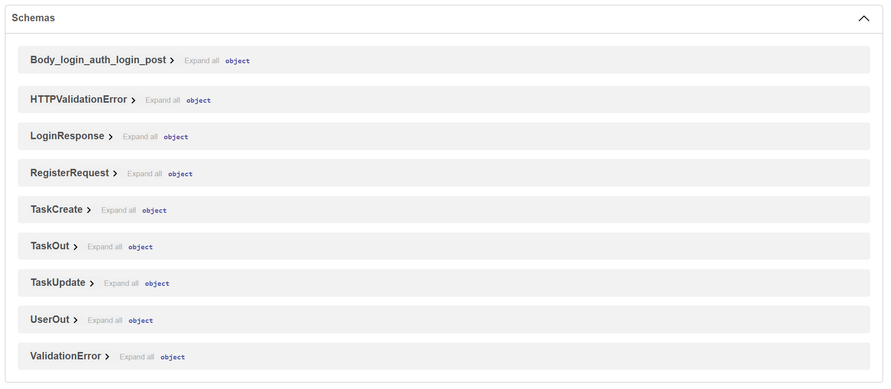
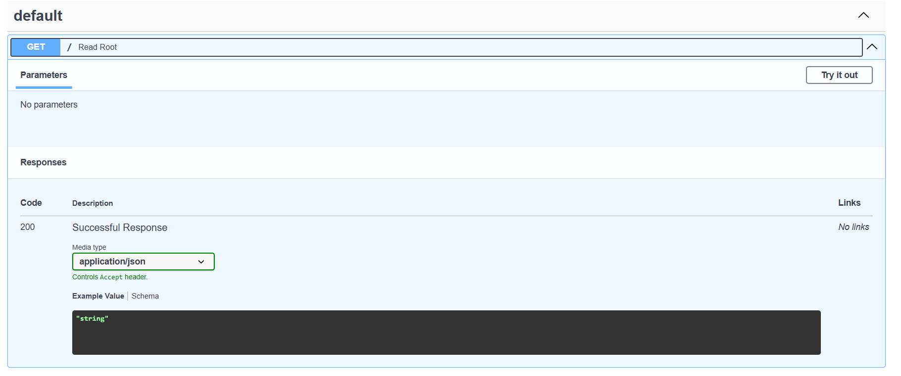
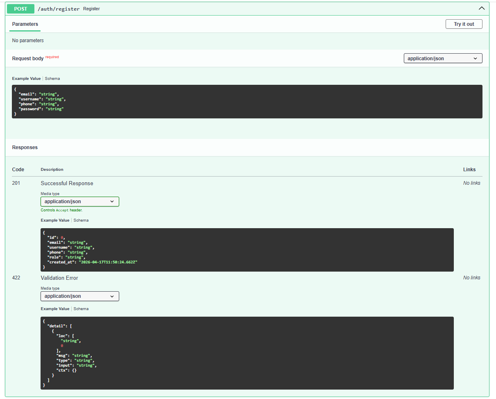
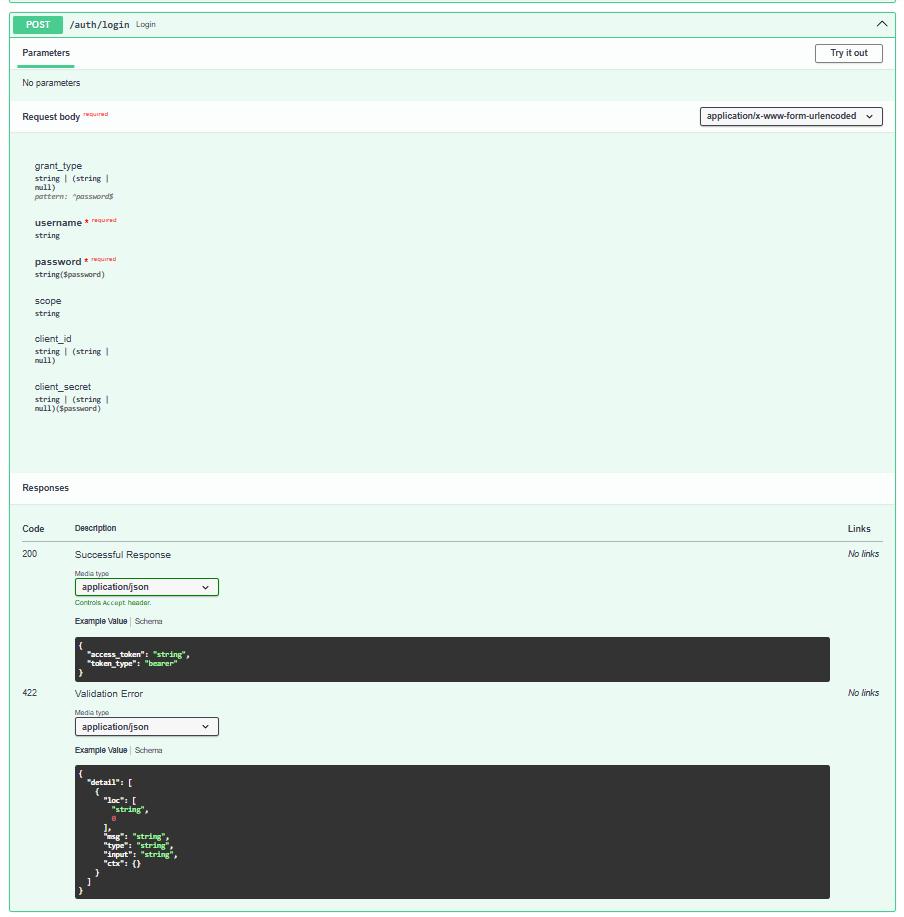
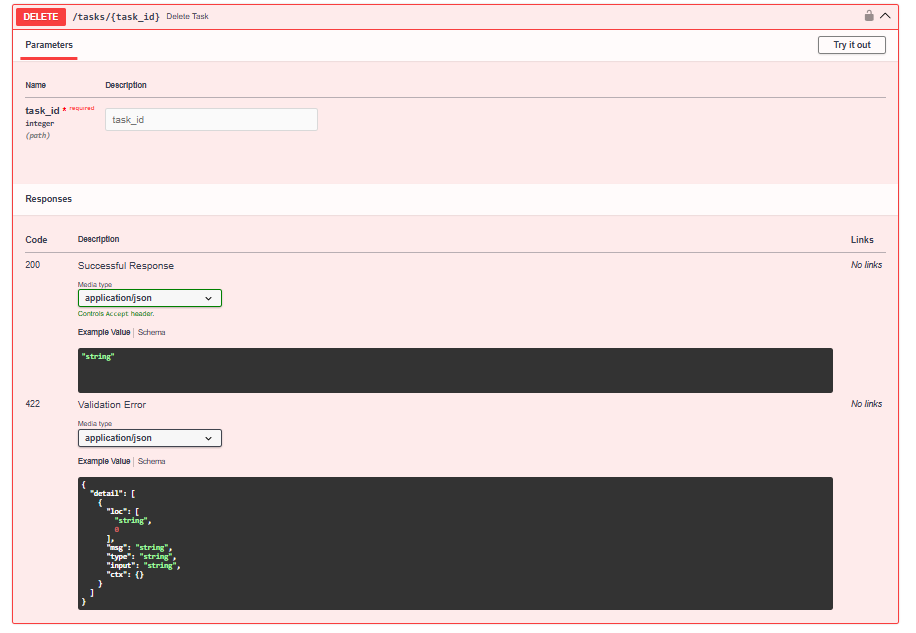
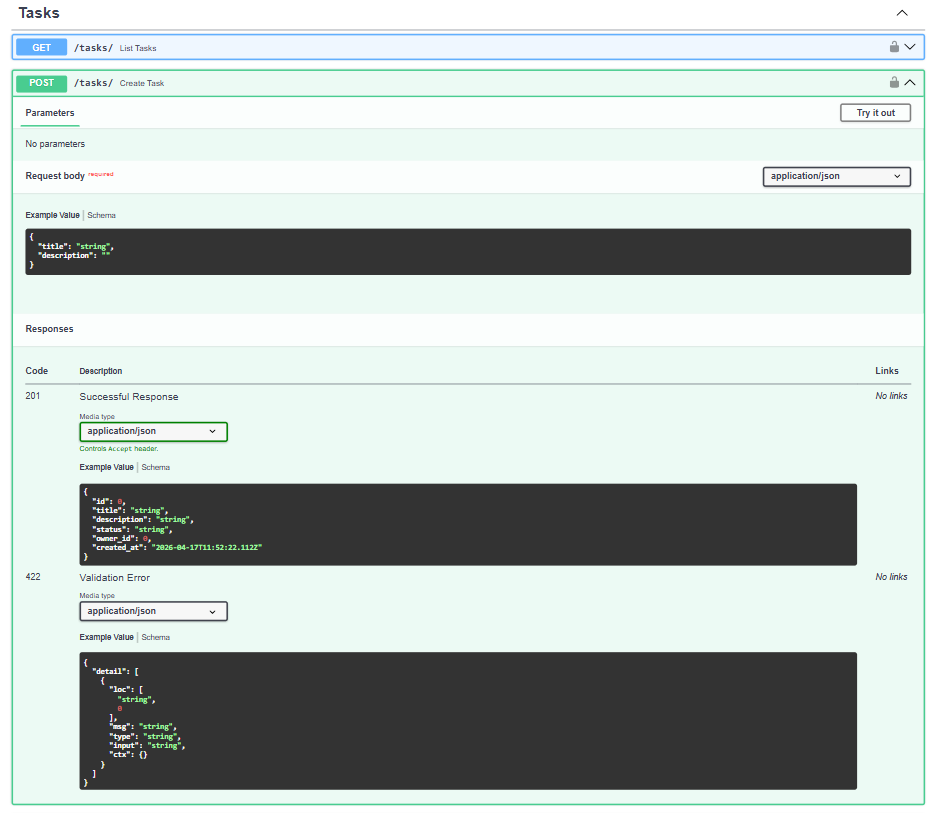
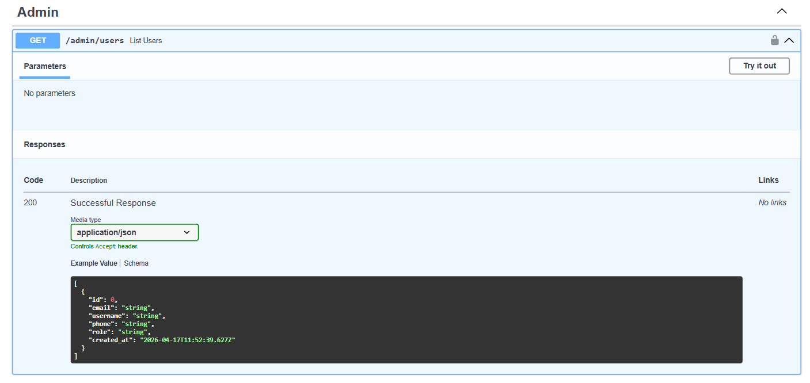
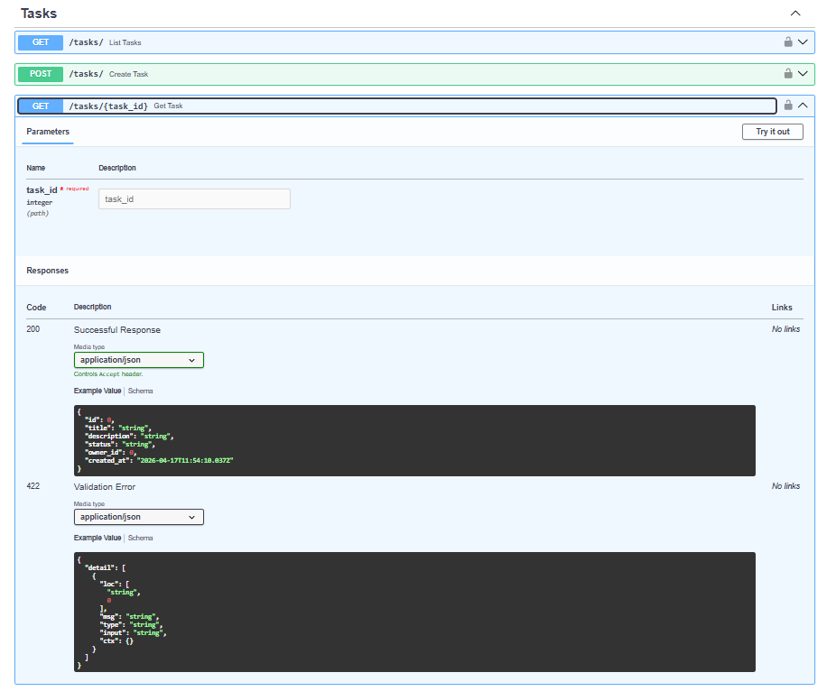
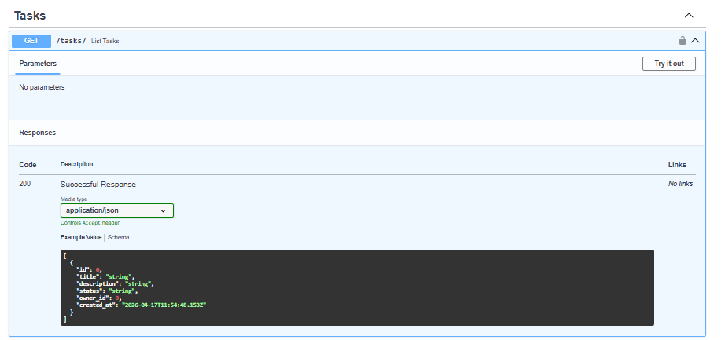
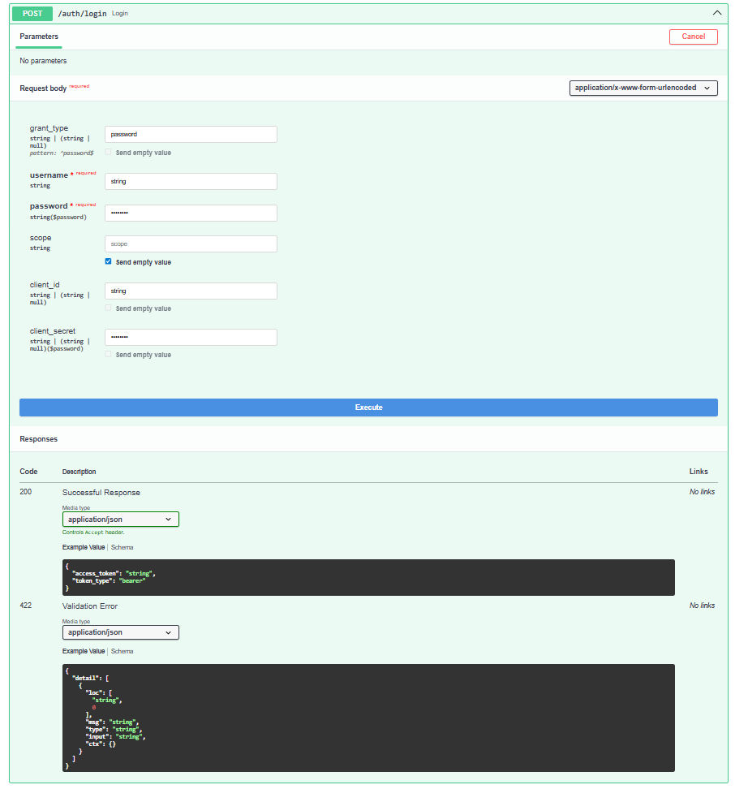
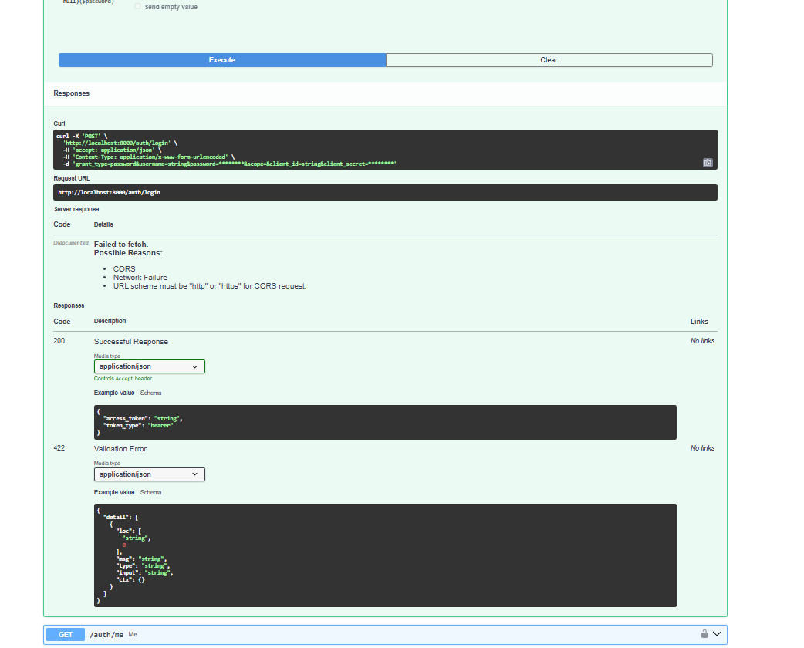

---

### Docker

Состоит из двух сервисов:
- **backend** — FastAPI (uvicorn)
- **redis** — кэш


---

### Реализовано

- Разбиение монолита на модульную структуру  
- Чистая архитектура  
- JWT-аутентификация  
- Redis-кэширование  
- Запуск через Docker Compose  
- Автогенерируемая Swagger-документация  

---
=======
# Task Tracker API

Проект в процессе рефакторинга из монолита в чистую структуру.
>>>>>>> f288b6a259cfa99c6d34b38d1f98492c44117b3c
